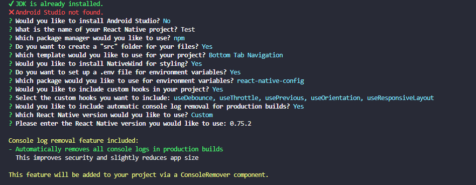
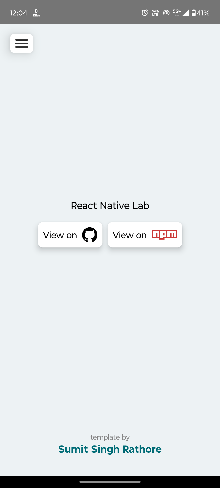

<h1 style="text-align: center;">React Native Lab</h1>


**GITHUB** \


[](https://github.com/developer-sumit/react-native-lab/actions/workflows/publish.yml)

**NPM** \


`react-native-lab` is a cli tool to set up a React Native project with some pre-defined configurations. This tool helps you quickly set up a React Native development environment, including installing necessary dependencies like JDK, Android Studio.

This project is inspired by the simplicity and effectiveness of [create-next-app](https://github.com/vercel/next.js/tree/canary/packages/create-next-app).

<h2 style="text-align: center;">Table of Contents</h2>

- 🚀 [Features](#features)
- 📸 [Screenshots](#screenshots)
- ⚙️ [Prerequisites](#prerequisites)
- 🏁 [Getting Started](#getting-started)
- 🛠️ [Common Issues](#common-issues)
- 🆘 [Getting Help](#getting-help)
- 🤝 [Contributing](#contributing)
- 📜 [License](#license)

<h2 id="features" style="text-align: center;">🚀 Features</h2>

1. **Installs JDK (OpenJDK)**: Automatically installs the necessary JDK for Android development.
1. **Installs Android Studio**: Sets up Android Studio, including the necessary SDKs and tools.
1. **Sets Environment Variables**: Configures system environment variables such as `ANDROID_HOME`, `ANDROID_SDK_ROOT`, and `JAVA_HOME`.
1. **Pre-built Templates**: Choose from a variety of pre-built templates to kickstart your React Native project.

   - `Blank`
   - `Bottom Navigation`
   - `Drawer Navigation`
   - `Stack Navigation`
1. **Project Structure**: Creates an `src` folder for you want.
1. **Cross-Platform Support**: Works on `Windows`, `macOS`, and `Linux`.
1. **Environment Setup**:
   - Sets up a `.env` file for managing environment variables.
   - Offers choice between `react-native-config` and `react-native-dotenv` for handling environment variables.
1. **Alias Configuration**: Configures path aliases for cleaner and more manageable imports.
1. **NativeWind Integration**: Install and configure NativeWind for styling.
1. **React Native Version Selection**: Allows you to set up the project with your preferred React Native version.
1. **Console Remover**: Automatically removes console logs in production builds, enhancing security and slightly reducing app size.
1. **Custom Hooks**: Option to include a set of useful custom hooks:
   - `useDebounce`: Delays invoking a function until after a wait period.
   - `useThrottle`: Limits the rate at which a function can fire.
   - `usePrevious`: Accesses the previous value of a state or prop.
   - `useOrientation`: Detects and responds to device orientation changes.
   - `useResponsiveLayout`: Provides responsive layout information based on screen size.



<h2 id="screenshots" style="text-align: center;">📸 Screenshots</h2>

Here are the available templates you can use with `react-native-lab`:

<div style="display: grid; grid-template-columns: repeat(auto-fit, minmax(100px, 1fr)); gap: 15px; max-width: 500px;">
  <div style="text-align: center;">
    <h4>Blank Template</h4>
    
  </div>
  <div style="text-align: center;">
    <h4>Navigation Template</h4>
    
  </div>
</div>

<h2 id="prerequisites" style="text-align: center;">⚙️ Prerequisites</h2>

- Node.js (v18 or higher)
- npm (v6 or higher)

<h2 id="getting-started" style="text-align: center;">🏁 Getting Started</h2>

To get started with `react-native-lab`, follow these steps:

1. Ensure you have all the prerequisites installed on your system.
2. You can use `npx` to run the tool without installing it:
   ```sh
   npx react-native-lab@latest
   ```

<h2 id="common-issues" style="text-align: center;">🛠️ Common Issues</h2>

- **Installation Errors**: Ensure you have the correct versions of Node.js and npm installed. Try clearing the npm cache:
  ```sh
  npm cache clean --force
  ```
- **Permission Errors**: Run the command with elevated privileges (e.g., using `sudo` on macOS/Linux or running the terminal as an administrator on Windows).

<h2 id="getting-help" style="text-align: center;">🆘 Getting Help</h2>

If you need further assistance, you can:

- Check the [GitHub Issues](https://github.com/developer-sumit/react-native-lab/issues) for similar problems.
- Open a new issue with detailed information about your problem.
- Reach out to the community for support.

By following these steps, you should be able to resolve most issues and get your React Native project up and running smoothly.

<h2 id="contributing" style="text-align: center;">🤝 Contributing</h2>

Contributions are welcome! If you have any ideas, suggestions, or bug reports, please open an issue or submit a pull request.

To contribute:

1. Fork the repository.
2. Create a new branch (`git checkout -b feature`).
3. Make your changes.
4. Commit your changes (`git commit -m 'Add some feature'`).
5. Push to the branch (`git push origin feature`).
6. Open a pull request.

Please make sure to follow the project's coding guidelines and standards.

<h2 id="license" style="text-align: center;">📜 License</h2>

This project is licensed under the MIT License. See the [LICENSE](LICENSE) file for details.

<h2 id="changelog" style="text-align: center;">📜 Changelog</h2>

For a detailed list of changes and updates, please refer to the [Changelog](./CHANGELOG.md).
